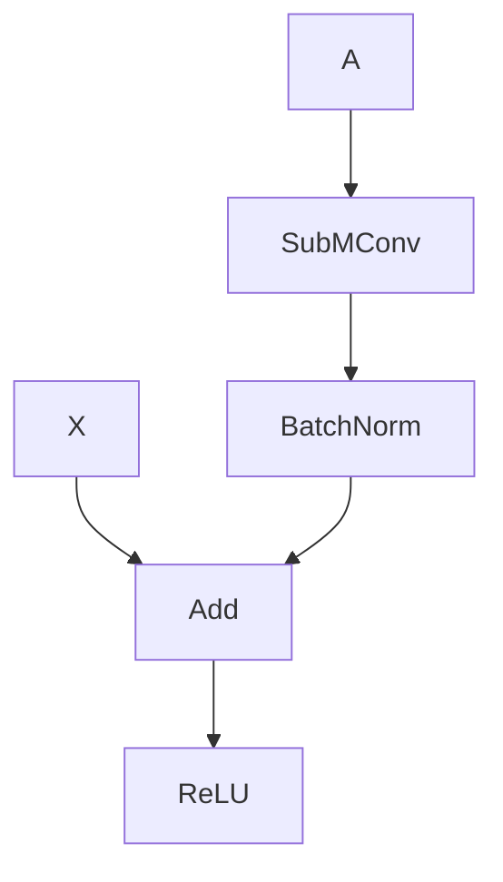
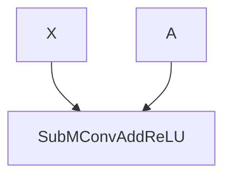

## Int8 Guide

This document aims to show how to perform PTQ/QAT/int8 inference in pytorch.

**WARNING** spconv int8 only support CUDA backend.
**WARNING** spconv int8 PTQ/QAT requires torch >= 1.13.

### Spconv Int8 Support

spconv currently support int8 kernels with following requirements: ```input_channel % 32 == 0 && output_channel % 32 == 0```. Int8 kernels runs faster than fp16 kernel with following shapes: 
```
C == 32 && K == 64
C == 64 && K == 32
C >= 64 && K >= 64
```

spconv currently don't support pooling int8 operation.

### Prepare model (Common)

We need to modify model to make sure it can be symbolic traced by ```torch.fx```. Here are some tips and requirements:

* only ```forward``` and its content can be traced.

* all conditional statement, such as ```if``` and ```assert```, can't depend on ```forward``` arguments. use a environment variable / global variable to remove asserts during tracing.

* all traced functions can't have dynamic arguments ```*args``` and ```**kwargs```. change them to static arguments or make them non traceable.

* non traceable code can be ignored by top-level functions and ```torch.nn.Module```, put all non-traceable code to state-less top-level functions or Modules:

1. write a top-level function (function declared in global scope), then use ```torch.fx.wrap``` to make sure it's non-traceable

2. write a Module that contains all non-traceable code.

* all attributes, methods and static functions are lost except non-traceable modules after tracing. if you still want to use some method in traced modules, you need to refactor them to a non-traceable child module, or make them static.

### Prepare model (Spconv)

Spconv int8 support subm residual fusion:



to 



Due to limitations of ```torch.fx```, this fusion requires your residual code have no spconv stuffs such as ```replace_feature```.

The following residual module can't be fused due to ```out.replace_feature``` and ```out.features```, this operations are recorded as a standalone node in graph, so it's hard to recognize and fuse them.

```Python
class SparseBasicBlock(spconv.SparseModule):
    expansion = 1
    def __init__(self,
                 in_planes, out_planes,
                 stride=1,
                 downsample=None):
        spconv.SparseModule.__init__(self)
        conv1 = spconv.SubMConv2d(in_planes, out_planes, 3, stride, 1, bias=False)
        conv2 = spconv.SubMConv2d(out_planes, out_planes, 3, stride, 1, bias=False)

        norm1 = nn.BatchNorm1d(out_planes, momentum=0.1)
        norm2 = nn.BatchNorm1d(out_planes, momentum=0.1)

        self.conv1_bn_relu = spconv.SparseSequential(conv=conv1, bn=norm1, relu=nn.ReLU(inplace=True))
        self.conv2_bn = spconv.SparseSequential(conv=conv2, bn=norm2)
        self.relu = nn.ReLU(inplace=True)
        self.downsample = downsample
        self.iden_for_fx_match = nn.Identity()

    def forward(self, x: spconv.SparseConvTensor):
        identity = x.features
        out = self.conv1_bn_relu(x)
        out = self.conv2_bn(out)

        if self.downsample is not None:
            identity = self.downsample(x)

        out = out.replace_feature(self.relu(out.features + identity))
        return out

```

The following residual module can be fused, it requires ```SparseReLU``` to avoid ```replace_feature``` node generated in ```torch.fx```

```Python
class SparseBasicBlock(spconv.SparseModule):
    """residual block that supported by spconv quantization.
    """
    expansion = 1
    def __init__(self,
                 in_planes, out_planes,
                 stride=1,
                 downsample=None):
        spconv.SparseModule.__init__(self)
        conv1 = spconv.SubMConv2d(in_planes, out_planes, 3, stride, 1, bias=False)
        conv2 = spconv.SubMConv2d(out_planes, out_planes, 3, stride, 1, bias=False)

        norm1 = nn.BatchNorm1d(out_planes, momentum=0.1)
        norm2 = nn.BatchNorm1d(out_planes, momentum=0.1)

        self.conv1_bn_relu = spconv.SparseSequential(conv=conv1, bn=norm1, relu=nn.ReLU(inplace=True))
        self.conv2_bn = spconv.SparseSequential(conv=conv2, bn=norm2)

        self.relu = spconv.SparseReLU(inplace=True)
        self.downsample = downsample
        self.iden_for_fx_match = spconv.SparseIdentity()

    def forward(self, x: spconv.SparseConvTensor):
        identity = x
        # if self.training:
        #     assert x.features.dim() == 2, f'x.features.dim()={x.features.dim()}'
        out = self.conv1_bn_relu(x)
        out = self.conv2_bn(out)

        if self.downsample is not None:
            identity = self.downsample(x)
        out = self.relu(out + identity)
        return out

```


### Post Training Quantization (PTQ)

see [example](../example/mnist/mnist_ptq.py) for a runnable example in mnist.

To perform PTQ in pytorch, we firstly need to trace model via ```torch.fx``` and insert observers to model.

spconv provide a simple function to do this:

```Python
import spconv.pytorch.quantization as spconvq
import torch.ao.quantization.quantize_fx as qfx

model = ...
is_qat = False
qconfig_mapping = spconvq.get_default_spconv_qconfig_mapping(is_qat)
# disable quantization for some layers here:
qconfig_mapping.set_module_name_regex("foo.*bar.*", None)
# disable quantization by type here:
qconfig_mapping.set_object_type(ModuleClass, None)

prepare_cfg = spconvq.get_spconv_prepare_custom_config()
# preserve static attrs for your module here:
prepare_cfg.preserved_attributes = [...]
# add nontraceable modules here:
prepare_cfg.non_traceable_module_classes.extend([...])

backend_cfg = spconvq.get_spconv_backend_config()
# add custom qconfig for your non-traceable operators:
backend_cfg.set_backend_pattern_config(BackendPatternConfig(some_op_or_module_class).set_observation_type(
    ObservationType.OUTPUT_USE_DIFFERENT_OBSERVER_AS_INPUT).set_dtype_configs(
        [non_weighted_op_qint8_dtype_config]))

# keep in mind that all model user attrs are lost in prepared_model.
prepared_model = qfx.prepare_fx(model, qconfig_mapping, (), backend_config=backend_cfg, prepare_custom_config=prepare_cfg)
```

the ```prepared_model``` contains PTQ observers to calculate int8 scales, then you can run inference with some test data:

```Python
for x in loader:
    prepared_model(x)
```

after inference of ```prepared_model```, all params required by int8 inference are calculated.

To perform debug int8 inference in pytorch, we need to do following thing:

```Python
with_linear = True
# pytorch don't support per-channel weight for Linear in native backend, we implement a simple fake-quantization to do this.
spconvq.prepare_spconv_torch_inference(with_linear) # must call before convert_fx

converted_model = qfx.convert_fx(prepared_model, qconfig_mapping=qconfig_mapping, backend_config=backend_cfg)
# transform all torch quantize_per_tensor to custom quantize_per_tensor to support SparseConvTensor
converted_model = spconvq.transform_qdq(converted_model)
# remove all dq node in fused residual node
converted_model = spconvq.remove_conv_add_dq(converted_model)

test(converted_model)

```

After test, we need to convert torch model to tensorrt. please see [this doc](TENSORRT_INT8_GUIDE.md) for more details.

Since all int8 kernels are compiled in runtime in spconv python package, you can use environment variable ```SPCONV_INT8_DEBUG=1``` to remove most of candidate int8 kernels to reduce compile time.

If you get error that some op don't support CUDA backend, just disable quantization for them in ```qconfig_mapping```.

### Quantization Aware Training (QAT)

see [example](../example/mnist/mnist_qat.py) for a runnable example in mnist.

To perform QAT in pytorch, we firstly need to trace model via ```torch.fx``` and insert observers and fake quantize nodes to model.

```Python
import spconv.pytorch.quantization as spconvq
import torch.ao.quantization.quantize_fx as qfx

model = ...
is_qat = True
qconfig_mapping = spconvq.get_default_spconv_qconfig_mapping(is_qat)
prepare_cfg = spconvq.get_spconv_prepare_custom_config()
backend_cfg = spconvq.get_spconv_backend_config()
# keep in mind that all model user attrs are lost in prepared_model.
prepared_model = qfx.prepare_qat_fx(model, qconfig_mapping, (), backend_config=backend_cfg, prepare_custom_config=prepare_cfg)
```

the ```prepared_model``` contains QAT observers and fake quantize nodes, then you can run training:

```Python
train(prepared_model)
```

After training, we can use same code in PTQ to run torch int8 inference.


### Performance Guide

For int8 kernels, we find that disable sort in implicit gemm can increase performance, so don't forget to disable sort by:
```C++
bool do_sort = false;
pair_res = SpconvOps::get_indice_pairs_implicit_gemm(
    alloc, input_indices_real, batch_size, input_dims,
    static_cast<int>(conv_algo), ksize, stride, padding, dilation,
    {0, 0, 0}, is_subm, transpose, false /*is_train*/,
    reinterpret_cast<std::uintptr_t>(stream), out_inds_num_limit,
    tv::CUDAKernelTimer(false), use_direct_table, do_sort);

```

